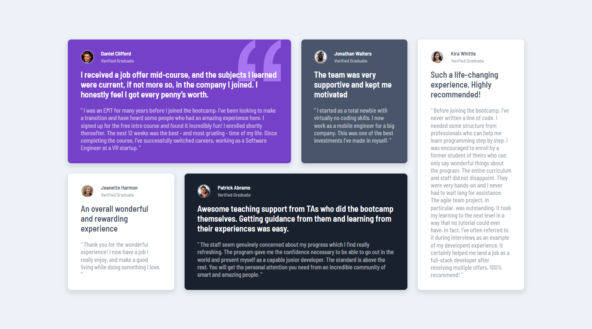

# Frontend Mentor - Testimonials grid section solution

This is a solution to the [Testimonials grid section challenge on Frontend Mentor](https://www.frontendmentor.io/challenges/testimonials-grid-section-Nnw6J7Un7). Frontend Mentor challenges help you improve your coding skills by building realistic projects. 

## Table of contents

- [Overview](#overview)
  - [Screenshot](#screenshot)
  - [Links](#links)
- [My process](#my-process)
  - [Built with](#built-with)
  - [What I learned](#what-i-learned)
  - [Continued development](#continued-development)
- [Author](#author)

## Overview

### Screenshot

### Links

- Live Site URL: [Testimonials grid section](https://testimonials-grid-section-main.dodeun.com/)

## My process

### Built with

- Semantic HTML5 markup
- CSS custom properties
- Flexbox
- CSS Grid
- Mobile-first workflow
- SASS

### What I learned

I learned how to position an img in the background using background-position, but I am not sure it was the best way to do it.

### Continued development

Using grid-template-areas was fun , using it with more complex grid column and row sizes could be interesting. 

## Author

- Frontend Mentor - [@Dodeun](https://www.frontendmentor.io/profile/Dodeun)